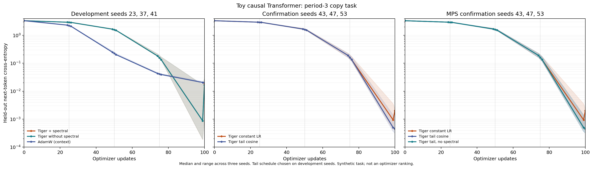

# Toy causal Transformer learning, 2026-09-27

This is a finite **learning** probe, separate from the fixed-random-target
TinyMix timing fixture. A one-layer, four-head causal Transformer predicts the
next token of a period-3 sequence. Each sequence starts with three distinct
random symbols; later symbols repeat them. Loss covers ten positions that
have enough causal context to retrieve the required earlier symbol. The 768
training and 256 held-out triples are disjoint for each seed. A metamorphic
CPU check confirmed that changing future tokens does not change earlier
logits. The synthetic task establishes neither language-model quality nor an
optimizer ranking.

The model uses `nn.MultiheadAttention` with fused `in_proj_weight` and
`in_proj_bias`. The benchmark asserts that both parameters receive dim-0
three-way QKV rules, the fused weight has a nonzero gradient at steps
25/50/75/100, and adaptation metrics are finite. With spectral enabled, the recorded frequency
factor and phase boost differ from 1; with spectral disabled, both are 1.

## Mac CPU and MPS results

Runs used merged `main` after PR #54, source commit `43313d86d2320dc1dc0766d91421bc9e46262c16`,
Apple M4, macOS 26.4.1, Python 3.12.6, and PyTorch 2.12.1. CPU runs used
one CPU thread; MPS runs recorded four CPU threads.
Each mode ran in a fresh process, with 100 updates and the same initial
weights, training/held-out corpus, and minibatch indices per seed. The
benchmark records SHA-256 values for each of these inputs. Tiger used the
tagged QKV groups, preconditioned trust with clip 5, parameter RMS clip 1,
FP32 update buffer, constant initial LR 0.01, and disabled automatic LR/blend.
This recipe follows the existing CPU quality smoke. AdamW used LR 0.003,
weight decay 0, and serves only as a contextual learning reference.

| Development seed | Tiger spectral, constant CE | Tiger no spectral, constant CE | Tiger spectral, tail CE | Tiger no spectral, tail CE | AdamW constant CE |
| ---: | ---: | ---: | ---: | ---: | ---: |
| 23 | 0.001128 | 0.001136 | 0.000480 | 0.000480 | 0.020148 |
| 37 | 0.029047 | 0.029789 | 0.000614 | 0.000614 | 0.019731 |
| 41 | 0.018346 | 0.016410 | 0.003373 | 0.003376 | 0.022230 |

All values are held-out next-token cross-entropy after step 100. Both Tiger
spectral modes learned in all three development seeds; spectral adaptation
has no consistent quality advantage on this task. Seed 37's held-out CE
jumped from 0.000185 after step 99 to 0.029047 after step 100 with constant
LR and spectral enabled. The spectral-off run showed the same jump. The
training-set CE rose too, so this is an end-of-run update fluctuation rather
than a held-out split error. The step-100 QKV scale recomputation occurs
after that update; no spectral-specific cause is established.

We then tried a full-period cosine schedule on development seed 37. At 100
steps it underfit (held-out CE 1.471). A **tail cosine** schedule retained LR
0.01 through step 91, then decayed for steps 92–100 toward 0.001;
its step-100 update used LR 0.001220. This schedule was selected
after seeing the development results. Three new confirmation seeds compared
the fixed recipe with and without that schedule:

| Confirmation seed | Tiger spectral, constant CE | Tiger spectral, tail CE |
| ---: | ---: | ---: |
| 43 | 0.002254 | 0.001268 |
| 47 | 0.002029 | 0.000318 |
| 53 | 0.001379 | 0.000451 |

The tail schedule lowered the step-100 held-out CE on all three confirmation
seeds. The same seeds were then run on MPS, including a spectral-off tail
control:

| MPS confirmation seed | Tiger spectral, constant CE | Tiger spectral, tail CE | Tiger no spectral, tail CE |
| ---: | ---: | ---: | ---: |
| 43 | 0.002254 | 0.001268 | 0.001270 |
| 47 | 0.002028 | 0.000318 | 0.000318 |
| 53 | 0.001378 | 0.000451 | 0.000451 |

The MPS runs used the same initial weights, corpus, and minibatches as the
CPU confirmation runs. They show the same quality trend within this finite
task; CPU and MPS results are close, but are not claimed bitwise equal.
Spectral-on and spectral-off tail CE were close on MPS. This remains a
narrow result for one synthetic task and 100 updates.

AdamW's different LR and Tiger's tag-specific scales rule out a method
ranking. CPU and MPS `optimizer.step()` times are in the raw files but were
collected one process per mode with changing host load, so they are
diagnostic only. The MPS runs began after another long-running model job
finished. No Tiger optimizer source or defaults changed in this work.



## Reproduce and verify

On the measured Mac, `python3 -S` avoided a `sitecustomize` override of the
default device. From the repository root, with Python 3.12 and PyTorch in
the path below:

```sh
export PYTHONPATH='/Library/Frameworks/Python.framework/Versions/3.12/lib/python3.12/site-packages:src'
python3 -S benchmarks/bench_toy_transformer_learning.py --mode tiger-full --device cpu --steps 100 --seeds 23 37 41 --output /tmp/tiger-full-constant.json
python3 -S benchmarks/bench_toy_transformer_learning.py --mode tiger-no-spectral --device cpu --steps 100 --seeds 23 37 41 --output /tmp/tiger-off-constant.json
python3 -S benchmarks/bench_toy_transformer_learning.py --mode tiger-full --device cpu --steps 100 --seeds 43 47 53 --output /tmp/tiger-full-confirm-constant.json
python3 -S benchmarks/bench_toy_transformer_learning.py --mode tiger-full --device cpu --steps 100 --seeds 43 47 53 --schedule tail-cosine --min-lr 0.001 --output /tmp/tiger-full-confirm-tail.json
python3 -S benchmarks/bench_toy_transformer_learning.py --mode tiger-full --device mps --steps 100 --seeds 43 47 53 --schedule tail-cosine --min-lr 0.001 --output /tmp/tiger-full-confirm-tail-mps.json
python3 benchmarks/evidence/2026-09-27-toy-transformer-learning/compare.py
python3 benchmarks/evidence/2026-09-27-toy-transformer-learning/plot.py
```

The archived locked runs use the same benchmark SHA-256 and source commit.
At CPU run time, Git reported the untracked evidence directory. The MPS
runs also saw this README modified; the benchmark and Tiger source hashes
were unchanged and recorded separately. The three
initial constant-mode runs from the preceding benchmark commit are retained
under `raw/initial/`. `compare.py` verifies that the locked script reproduced
their complete evaluation traces exactly. The `raw/locked/*.json.gz` files
contain all step traces, QKV metrics, and input hashes. They use deterministic
gzip headers; `gzip -dc` reads a file. Run
`shasum -a 256 -c SHA256SUMS` in this directory to verify the archive.
