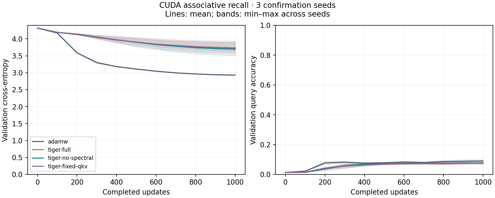

# CUDA multi-query recall, 2026-09-30

## Protocol

The [plan](plan.json) was committed before development runs. A four-layer,
width-192, six-head causal Transformer (1,830,144 parameters) receives 16 unique keys paired with
random values, followed by 64 gap tokens and four queries. Only the queried
values are supervised; the query suffix contains no answers. The vocabulary
contains 64 keys, 64 values, and two special tokens. Inputs are 104 tokens long.
This is synthetic retrieval, not a natural-language benchmark.

Training uses fresh generated examples at every update, batch 64, BF16
autocast, FP32 parameters/optimizer state, global gradient clipping at 1.0,
zero weight decay, 5% linear warmup, and cosine decay to a 0.1 LR multiplier.
Tiger uses tagged groups, preconditioned trust capped at 5, and per-parameter
RMS clipping at 1. FFN asymmetry and LoRA cross-adaptation are disabled.
Tiger's tag scales and trust are part of its recipe; AdamW is a reference under
the stated search budget, not an exhaustive optimizer comparison.

Development: seed 101, 300 updates, three learning rates each for AdamW and
Tiger. The lowest final validation CE selects each family's LR. Development
does not create or evaluate test data. Both families selected **0.001**.

Confirmation: new seeds 211/223/227, 1000 updates, four modes per seed:

- AdamW at its selected LR.
- Tiger with QKV adaptation and spectral feedback.
- Tiger with QKV adaptation but no spectral feedback.
- Tiger with fixed QKV multipliers 0.9/0.8/1.1.

All Tiger modes use the selected Tiger LR, default QKV gain 0.02 and interval
25. Per seed, models start with identical weights and consume identical data
in the same order. Validation uses 512 examples; the final test uses 2048
examples (8192 queries), evaluated once after training. Mode order rotates
between seeds. No configuration changes are made from confirmation results.

The query-independent context baseline predicts the empirical value
distribution within the context; its accuracy uses the most frequent value
(smallest value wins ties). This descriptive baseline is computed afterward
from reconstructed test inputs, whose hashes must match the recorded inputs.
It does not influence LR selection.

## Reproduction

Measured source: `c4c6c644231e0bbbcd2f7bcb213e4d9df2df4278`, after the group-scale
fix in PR #57. The subsequent CLI guard rejects using the same output and
checkpoint path; it does not change training. The raw records pin all measured
package source hashes. Runs took place in an isolated Linux checkout on RTX
5090 with PyTorch 2.13.0+cu132 and driver 595.84, using two CPU threads per run.
Other CPU jobs remained active; elapsed times are diagnostic, not speed claims.

From the repository root, use a fresh output directory:

```sh
python benchmarks/evidence/2026-09-30-cuda-recall/run_suite.py \
  --phase development --output-dir benchmarks/results/recall
python benchmarks/evidence/2026-09-30-cuda-recall/run_suite.py \
  --phase confirmation --output-dir benchmarks/results/recall
```

For exact source reproduction, check out the measured commit before running.
`selection.json` freezes the selected rates and plan hash between phases.
The benchmark refuses to overwrite existing results and records `running`,
`failed`, or `complete` explicitly.

## Results

All six development runs and twelve confirmation runs completed with finite
losses. The confirmation budget is 64,000 training examples per run, or
6,656,000 input tokens and 256,000 supervised queries. Input and initial-model
hashes match across all paired modes; the normalized LR traces also match.

Final test results, mean across three seeds (range in parentheses):

| Mode | Test CE | Query accuracy |
| --- | ---: | ---: |
| AdamW | 2.9335 (2.9234–2.9406) | 8.55% (8.37–8.76%) |
| Tiger full | 3.7349 (3.6333–3.9020) | 7.59% (6.99–8.06%) |
| Tiger, spectral off | 3.6936 (3.5015–3.8938) | 7.69% (7.28–8.23%) |
| Tiger, fixed QKV | 3.7208 (3.5511–3.9453) | 7.47% (6.73–8.07%) |
| Context-frequency baseline, no key lookup | 2.6127 | 12.42% |



The context baseline is stronger than uniform value guessing (1.5625%). All
four learned recipes underperform it at 1000 updates, so these runs do **not**
establish successful associative retrieval. AdamW performs better than the
tested Tiger recipe under this limited search/update budget. Tiger's chosen
LR is at the low end of its three-candidate search; the study does not exhaust
its possible configurations.

Spectral feedback beats spectral-off CE in only **1/3** seeds. Full adaptation
beats fixed QKV in **2/3** seeds but has worse mean CE because of the third seed.
The QKV multipliers demonstrably change when enabled and stay fixed in the
control. Neither result establishes a robust benefit for spectral adaptation
or justifies changing optimizer defaults.

Exact seed results, final slice scales, and development scores are in
[`summary.json`](summary.json). The chart shows validation mean and min–max
across seeds, not confidence intervals. Test data were evaluated only at the
end of each run; no confirmation settings were changed afterward.

### Additional learnability check

After observing that all four recipes fell below the context baseline, a
separate [diagnostic plan](diagnostic_plan.json) extended AdamW to 5000 updates
on seed 307 at the already selected LR. This was one exploratory development
run, with no test set and no changes to the frozen confirmation comparison.

It ended at validation CE **2.7298**, accuracy **10.11%**. On the same validation
inputs, the context-frequency baseline reached CE **2.6238**, accuracy
**11.57%**. The longer run also did not demonstrate retrieval mastery.

The archive therefore contains **19 completed runs**, including this additional
negative diagnostic. A successful model-learning control remains unresolved;
the harness currently exposes a failure to learn under these recipes and
budgets. It should not be used to justify new optimizer defaults. Next work
needs to establish a learnable control (task/architecture/training recipe)
before attributing retrieval gains to Tiger's adaptive components.

Reproduce the diagnostic separately:

```sh
python benchmarks/bench_associative_recall.py \
  --mode adamw --device cuda --precision bf16 --lr 0.001 --seed 307 \
  --steps 5000 --eval-interval 500 --development \
  --output benchmarks/results/recall-diagnostic-307.json
```

Run that command from the repository root. Its raw record is under
`diagnostics/`; the original 18 runs are under `raw/`.

## Verify the archive

From this directory, with the repository history and benchmark dependencies:

```sh
python summarize.py
python plot.py
shasum -a 256 -c SHA256SUMS
```

The summarizer checks decompressed hashes, measured Git source hashes, paired
input/initial-state identity, completion, LR selection, schedule factors, and
QKV ablation behavior. It reconstructs the test data and checks their recorded
hashes before computing the context baseline. `manifest.json` stores raw-byte
hashes; deterministic gzip preserves every original JSON byte. The checksum
file also covers the scripts, summary, plans, documentation, and plot.
