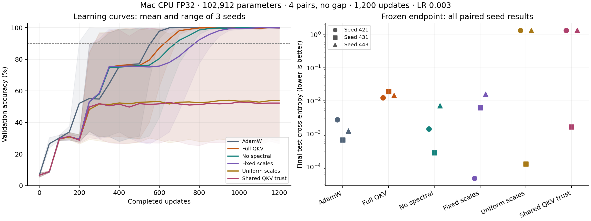

# Mac QKV component ablation — 2026-10-01

## Question and learning control

Which QKV controls help once the model can learn key/value retrieval? The
[larger CUDA stress task](../2026-09-30-cuda-recall/README.md) did not establish
retrieval mastery, including an extended AdamW control. This experiment uses
the same causal architecture and generator with a shorter, learnable task:
4 pairs, 16 symbols, no gap, 2 queries, width 64, 2 layers, 4 heads, **102,912
parameters**, and 12 input tokens. Answers never appear in the query suffix.

An exploratory AdamW run reached 100% validation accuracy by update 400. Its
receipt is preserved separately under `preflight/` at commit `039964e`. The
[plan](plan.json), six-mode implementation and runner were then committed as
**`5253d2d06d7a612f3dbc37e5c7fd84fd3c529e75`** before development or confirmation.
All 26 archived receipts are complete and record clean measured checkouts.

The binding check rotates context values while preserving the keys, queries
and value multiset. The model is evaluated against both the newly correct
answers and the obsolete original answers. A query-independent value-bag
strategy cannot follow this change. This checks learned binding sensitivity;
it does not establish general retrieval or long-context capability.

## Frozen protocol

- Mac CPU FP32, Python 3.12.6, PyTorch 2.12.1, two CPU threads.
- Batch 32, 1,200 updates, 38,400 training examples; validation 256 and test
  1,024 contexts, each with two queries. Validation sampled every 50 updates.
- Development seed 401: AdamW rates 0.0003/0.001/0.003; full Tiger QKV rates
  0.001/0.003/0.01. Choose the lowest final validation CE per family. Development
  never creates test data. Both selected **LR 0.003** and passed the gate:
  original and rebound validation accuracy ≥90%, obsolete-answer accuracy ≤20%.
- Confirmation seeds **421, 431, 443**, rotating run order. Every Tiger ablation
  shares the full recipe's selected LR; ablations are not separately tuned.
- Per seed, initialization, training examples/order, validation/test data,
  global gradient clipping and normalized warmup/cosine LR traces match.
  Train/validation/test memory contexts are disjoint, checked from generated
  inputs. Test is evaluated after the fixed training budget; no best-checkpoint
  selection or confirmation-driven retuning.
- Primary metric: final original-test CE. Secondary: original/rebound accuracy,
  obsolete-answer accuracy, validation CE averaged over sampled updates 50–1200,
  and the first sampled update at ≥90% validation accuracy.

All Tiger modes retain tagged groups, preconditioned trust (cap 5), FP32
buffers, per-parameter RMS clipping at 1, zero decay, and disabled auto LR,
auto blend, FFN asymmetry and LoRA cross-adaptation. `full` here means the full
QKV recipe, not every optional Tiger mechanism. Adaptive modes use the default
25-update cadence and gain 0.02.

| Mode | Initial Q/K/V scales | LR adaptation | Spectral feedback | Slice trust |
| --- | --- | --- | --- | --- |
| `tiger-full` | 0.9/0.8/1.1 | On | On | Separate |
| `tiger-no-spectral` | 0.9/0.8/1.1 | On | Off | Separate |
| `tiger-fixed-qkv` | 0.9/0.8/1.1 | Off | Off | Separate |
| `tiger-uniform-qkv` | 1/1/1 | Off | Off | Separate |
| `tiger-global-trust` | 1/1/1 | Off | Off | Shared within each fused QKV tensor |

The last mode changes only `qkv_trust_split`; other parameter groups retain
their trust behavior. AdamW is a separately configured reference. These are
conditional effects along this ablation chain, not a full factorial study or
each recipe's best achievable performance.

## Confirmation results

Test CE columns include every seed. Accuracy columns are arithmetic means
across the three seeds; each seed has 2,048 test queries.

| Mode | CE 421 | CE 431 | CE 443 | Mean CE | Test accuracy | Rebound accuracy |
| --- | ---: | ---: | ---: | ---: | ---: | ---: |
| AdamW | 0.002680 | 0.000654 | 0.001222 | 0.001519 | 100.00% | 100.00% |
| Full QKV | 0.012418 | 0.018998 | 0.014663 | 0.015360 | 99.76% | 99.87% |
| No spectral | 0.001413 | 0.000272 | 0.007239 | 0.002974 | 99.92% | 99.93% |
| Fixed scales | 0.000046 | 0.006185 | 0.016072 | 0.007434 | 99.79% | 99.82% |
| Uniform scales | 1.360300 | 0.000123 | 1.359078 | 0.906500 | 53.01% | 53.60% |
| Shared QKV trust | 1.360420 | 0.001628 | 1.366330 | 0.909459 | 52.85% | 52.69% |

AdamW and the three asymmetric-scale Tiger modes learn the new bindings in
all three seeds; their obsolete-answer accuracy is 6.15–7.08%. Rebinding changes
93.07–93.80% of targets. Uniform-scale and shared-trust modes fail the ≥90%
binding gate in seeds 421 and 443, also falling below the original-test
context-mode baseline in those seeds (33.15% and 35.30%). They pass in seed 431.
The query-independent context-mode baseline averages 34.08% across the seeds.



### One component at a time

Each delta is **feature minus control**; negative CE is better. A count is the
number of seeds with lower final test CE, not a statistical significance test.

| Component and comparison | Mean test CE delta | Lower test CE | Sampled validation CE delta, seeds 421/431/443 |
| --- | ---: | ---: | --- |
| Spectral: full vs no spectral | +0.012385 | 0/3 | −0.001932 / −0.018232 / −0.064276 |
| Adaptive slice LR: no spectral vs fixed | −0.004460 | 2/3 | −0.007947 / +0.037703 / −0.120463 |
| Fixed slice scales: fixed vs uniform | −0.899066 | 2/3 | −1.079766 / +0.000786 / −0.512424 |
| Separate slice trust: uniform vs shared | −0.002959 | 3/3 | −0.015066 / −0.031715 / −0.023140 |

**Fixed asymmetric scales have the largest observed effect at this frozen LR**,
turning two failed uniform-scale runs into successful retrieval. The seed 431
endpoint is worse than uniform scales, so the effect is not uniformly positive.
The mean scale is 0.9333 rather than 1.0; this contrast does not separate
relative allocation from average update size. A normalized-scale control and
a separate development LR search for uniform scales remain useful follow-ups.

Adaptive slice LR improves final CE in two seeds. Spectral feedback lowers
sampled validation CE in all three but worsens final test CE in all three.
The full recipe's late validation loss fluctuates; the archive keeps those
fluctuations rather than selecting an earlier checkpoint. Separate slice trust
has a small consistent CE benefit under uniform scales, while two runs still
fail retrieval. None of these outcomes establishes superiority over AdamW,
which has lower final CE than full QKV on every confirmation seed.

## Supplementary MPS replay

After the CPU comparison, full QKV was replayed on MPS FP32 using the first
confirmation seed (421), with the same initialization/data hashes, LR and
budget. Test CE **0.007703**, original accuracy **99.90%**, rebound accuracy
**99.95%**, obsolete-answer accuracy **6.20%**. This confirms the short binding
task can also be learned on MPS. It is one replay, not a device-parity or
speed comparison; numerical trajectories and endpoints differ from CPU.

## Reproduce and validate

From the repository root, with the source commit above checked out and
`tiger-optim[dev]` dependencies available:

```sh
python benchmarks/evidence/2026-10-01-mac-qkv-ablation/run_suite.py \
  --phase development --output-dir benchmarks/results/mac-qkv-fresh
python benchmarks/evidence/2026-10-01-mac-qkv-ablation/run_suite.py \
  --phase confirmation --output-dir benchmarks/results/mac-qkv-fresh
```

Use a fresh output directory. On the current checkout, validate archived
receipts and regenerate the derived report and figure:

```sh
python benchmarks/evidence/2026-10-01-mac-qkv-ablation/summarize.py
python benchmarks/evidence/2026-10-01-mac-qkv-ablation/plot.py
```

The validator needs Git history containing the measured source commits. It
verifies decompressed receipt SHA-256s against [manifest.json](manifest.json),
historical source hashes, completion/finite losses, selection, matching inputs,
context separation, actual controls and adaptive scale traces. It regenerates
[summary.json](summary.json). Raw JSONs use gzip with timestamp zero, preserving
their original decompressed bytes. The exploratory preflight, six development
runs, eighteen confirmation runs and one MPS replay are all retained.

Local invocation used Python's `-S` with an explicit dependency `PYTHONPATH`
to avoid a machine-local default-device override. CPU is selected explicitly
before model initialization and input generation. Timing fields are diagnostic
only; host load was uncontrolled. This short synthetic control does not resolve
the harder CUDA task or measure LoRA mechanisms. No production defaults change.
