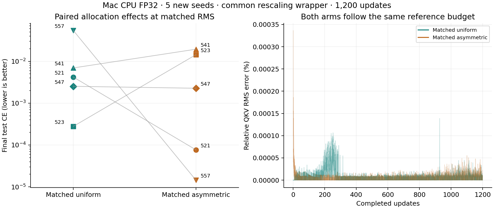

# QKV allocation at matched physical update RMS — 2026-10-01

## Question and intervention

Does asymmetric Q/K/V allocation help when **actual applied QKV update RMS is
matched at every step**? The preceding [2×2 mean-scale study](../2026-10-01-qkv-scale-factorial/README.md)
recorded larger physical updates under asymmetric allocation, despite equal
arithmetic mean LR scales. This follow-up uses a new intervention and five
additional seeds; its [plan](plan.json) and source were committed before runs
as **`2e331c969c45058ec3740ee1fbc512140b63abd9`**.

For each seed, an ordinary uniform-QKV reference runs first. Its **training
update** RMS trace becomes the budget for both comparison arms. After each
ordinary Tiger step, all QKV parameter deltas are multiplied by the same scalar:

```text
scale = reference_step_combined_QKV_RMS / candidate_step_combined_QKV_RMS
new_QKV = old_QKV + candidate_delta × scale
```

This preserves the candidate direction up to FP32 rounding. Both matched arms
use the same wrapper; non-QKV parameters and optimizer moments are not rewritten.
The intervention is a benchmark mechanism tied to a reference trajectory,
not a standalone optimizer recommendation. Only physical QKV magnitude is
constrained; non-QKV update magnitudes can differ along the resulting paths.

## Frozen protocol

Mac CPU FP32, Python 3.12.6, PyTorch 2.12.1, two threads. Same 102,912-parameter
short task, four pairs/16 symbols/no gap/two queries, width 64/two layers/four
heads. Batch 32, exactly 1,200 updates, validation 256 contexts every 50 updates,
test 1,024 contexts with 2,048 queries. LR **0.003** is inherited without tuning.

New seeds **521, 523, 541, 547, 557** are disjoint from both preceding studies.
Initialization, example/batch order, validation/test inputs, clipping and LR
traces match per seed. Memory contexts are disjoint across data splits. Slice
trust stays on; adaptive/spectral QKV, FFN asymmetry, auto LR/blend and LoRA
cross-adaptation stay off. All outcomes are retained.

| Recipe | Initial Q/K/V scales | Physical RMS intervention | Role |
| --- | --- | --- | --- |
| Reference uniform | 1/1/1 | None | Supplies training-step budgets |
| Matched uniform | 1/1/1 | On | Primary control |
| Matched asymmetric | 27/28, 6/7, 33/28 | On | Primary feature arm |

Both matched recipes have mean LR multiplier 1. Primary outcome is final
original-test CE: matched asymmetric minus matched uniform. The reference's
test outcome is not used to select a budget or exclude a seed. Dependent order
is intentional; timing has no comparative interpretation.

## Magnitude matching and results

All 15 runs completed with clean measured source. Across the **12,000 matched
updates** (two arms × five seeds × 1,200), the largest RMS relative error is
**0.0003364%**, below the frozen 0.1% tolerance. Every step is verified against
its reference training trace and recorded reference-file SHA-256.

| Recipe | Mean test CE | Original accuracy | Rebound accuracy | Binding gate |
| --- | ---: | ---: | ---: | ---: |
| Reference uniform | 0.007739 | 99.90% | 99.92% | 5/5 |
| Matched uniform | 0.013628 | 99.85% | 99.90% | 5/5 |
| Matched asymmetric | 0.007230 | 99.93% | 99.91% | 5/5 |

The binding gate requires original/rebound accuracy ≥90% and obsolete-answer
accuracy ≤20%. Both matched arms pass in all seeds. No gate failure is rescued
by changing allocation in this sample.

| Seed | Reference CE | Matched uniform CE | Matched asymmetric CE | Paired delta |
| --- | ---: | ---: | ---: | ---: |
| 521 | 0.018550 | 0.004189 | 0.000077 | −0.004112 |
| 523 | 0.007486 | 0.000279 | 0.014358 | +0.014079 |
| 541 | 0.000031 | 0.006944 | 0.019430 | +0.012487 |
| 547 | 0.007462 | 0.002525 | 0.002270 | −0.000255 |
| 557 | 0.005166 | 0.054202 | 0.000014 | −0.054188 |

Asymmetric allocation lowers final CE in **3/5 seeds**, mean delta
**−0.006398**. The favorable mean is driven by seed 557's much larger delta;
two seeds worsen. Sampled validation CE improves in 4/5 seeds, mean delta
−0.004195. First sampled ≥90% validation accuracy occurs 50 updates earlier
for asymmetric seed 521 and at the same sampled update for the other four.
These observations do not establish a general advantage or justify changing
production defaults.



### The uniform replay also changes numerically

The matched-uniform arm finishes with a different parameter hash than the
ordinary reference in **all five seeds**. FP32 reconstruction and subsequent
trajectory-dependent rescaling are not a bitwise replay of ordinary Tiger.
Its endpoint CE changes are visible in the table. The primary comparison
therefore uses the two arms with a common rescaling wrapper. Both have verified
equal QKV RMS budgets, but this experiment remains a reference-dependent
intervention. Rescale factors vary substantially: roughly 0.17–6.19 in the
uniform arm and 0.136–8.74 in the asymmetric arm across all updates.

This study uses different seeds from the mean-scale factorial; their accuracy
means should not be interpreted as an improvement caused by RMS matching.
The result is a bounded allocation comparison on an already learnable sample,
with no LoRA, long-context or general optimizer claim.

## Reproduce and validate

With the measured commit and recorded PyTorch version, from repo root:

```sh
python benchmarks/evidence/2026-10-01-qkv-rms-matched/run_suite.py \
  --output-dir benchmarks/results/qkv-rms-fresh
```

Use a fresh output directory. The ordinary reference must complete before the
two dependent arms. The CLI's `--qkv-rms-reference` requires a completed uniform
run with matching configuration, initialization/data and source hashes, plus
`--measure-qkv-updates`. It rejects invalid/zero candidate updates that cannot
meet a positive target and fails if the RMS tolerance is exceeded.

```sh
python benchmarks/evidence/2026-10-01-qkv-rms-matched/summarize.py
python benchmarks/evidence/2026-10-01-qkv-rms-matched/plot.py
```

The validator checks [manifest](manifest.json)/index/plan hashes, historical
source, clean completed runs, actual controls, regenerated initialization/data,
context separation, LR traces, finite delta RMS, reference provenance and
every matching target/error/rescale factor. It requires Git history containing
the measured commits and regenerates [summary.json](summary.json). Gzip has
timestamp zero and original decompressed bytes are preserved. Package code
matches the parent revision byte for byte. The local `-S` invocation bypassed a
machine-specific device override. Timing fields include experimental overhead
and uncontrolled host load; no speed claim is made.
