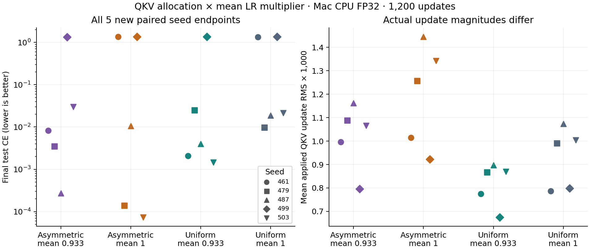

# QKV allocation × mean LR scale — 2026-10-01

## Why this follows the first component study

The [first Mac QKV study](../2026-10-01-mac-qkv-ablation/README.md) found a large
fixed-scale versus uniform-scale difference at LR 0.003. Those recipes changed
both relative Q/K/V allocation and the arithmetic mean multiplier (0.9333 versus
1). This frozen 2×2 study separates those factors and measures actual applied
parameter deltas. It then motivates the separate
[physical RMS matching experiment](../2026-10-01-qkv-rms-matched/README.md).

The [plan](plan.json), controls and runner were committed before all runs as
**`5f541465d3ef3d837ec25d9b248fa9d6ec3020ca`**. There are 20 CPU runs and two
supplementary MPS runs, all complete, with clean measured checkouts. The earlier
source, raw receipts and conclusions remain preserved in their own archive.

## Protocol

Same short binding task: 102,912 parameters, four pairs, 16 symbols, no gap,
two queries, width 64, two layers/four heads, batch 32, 1,200 updates. Validation
has 256 contexts sampled every 50 updates; final test has 1,024 contexts/2,048
queries. Python 3.12.6, PyTorch 2.12.1, CPU FP32, two threads. LR **0.003** is
inherited from the prior development selection; there is no new tuning.

Five new paired seeds: **461, 479, 487, 499, 503**, rotating run order. Per seed,
initialization, training examples/order, validation/test inputs and LR traces
match. Input memory contexts are disjoint between splits. Slice trust stays on;
LR/spectral adaptation, FFN asymmetry, auto LR/blend and LoRA cross-adaptation
stay off. Other Tiger settings follow the previous recipe.

| Cell | Mode | Q/K/V scales | Arithmetic mean |
| --- | --- | --- | ---: |
| Asymmetric, low mean | `tiger-fixed-qkv` | 0.9 / 0.8 / 1.1 | 14/15 |
| Asymmetric, unit mean | `tiger-normalized-qkv` | 27/28 / 6/7 / 33/28 | 1 |
| Uniform, low mean | `tiger-uniform-low-qkv` | 14/15 / 14/15 / 14/15 | 14/15 |
| Uniform, unit mean | `tiger-uniform-qkv` | 1 / 1 / 1 | 1 |

Both asymmetric cells preserve allocation **9:8:11**. The update recorder
measures post-step minus pre-step parameters across both fused QKV weights,
pooling squared deltas by slice and across all QKV entries. Equal arithmetic
mean multipliers do not force equal physical update RMS after trust/clipping
and diverging training trajectories.

## Results

All means include failed learning runs. The binding gate requires ≥90% original
and rebound accuracy and ≤20% obsolete-answer accuracy after value rebinding.

| Cell | Mean test CE | Original accuracy | Rebound accuracy | Gate passed | Mean applied QKV RMS |
| --- | ---: | ---: | ---: | ---: | ---: |
| Asymmetric, low mean | 0.275970 | 85.92% | 86.65% | 4/5 | 0.00102181 |
| Asymmetric, unit mean | 0.542125 | 71.83% | 72.80% | 3/5 | 0.00119665 |
| Uniform, low mean | 0.276307 | 85.85% | 86.32% | 4/5 | 0.00081687 |
| Uniform, unit mean | 0.551623 | 71.73% | 72.70% | 3/5 | 0.00093055 |

Seed 461 learns in both low-mean cells and fails in both unit-mean cells.
Seed 499 fails in all four cells. The other three seeds learn in all four.
Thus the large observed gate difference is reproduced by lowering the mean
multiplier even with uniform allocation. Asymmetric allocation alone rescues
no additional gate failure at either matched mean.

All final original-test CE values:

| Cell | 461 | 479 | 487 | 499 | 503 |
| --- | ---: | ---: | ---: | ---: | ---: |
| Asymmetric, low mean | 0.008173 | 0.003507 | 0.000274 | 1.337639 | 0.030257 |
| Asymmetric, unit mean | 1.347826 | 0.000138 | 0.010680 | 1.351907 | 0.000074 |
| Uniform, low mean | 0.002093 | 0.024845 | 0.004016 | 1.349124 | 0.001456 |
| Uniform, unit mean | 1.344310 | 0.009822 | 0.018608 | 1.363753 | 0.021623 |

Feature minus control CE deltas; negative is better:

| Contrast | Mean final test CE delta | Seeds with lower CE |
| --- | ---: | ---: |
| Asymmetric vs uniform, mean 14/15 | −0.000337 | 3/5 |
| Asymmetric vs uniform, mean 1 | −0.009499 | 4/5 |
| Mean 1 vs 14/15, uniform allocation | +0.275317 | 1/5 |
| Mean 1 vs 14/15, asymmetric allocation | +0.266155 | 2/5 |

The mean-scale deltas are dominated by seed 461's failed unit-mean runs.
Allocation lowers sampled validation CE in 5/5 low-mean seeds and 3/5 unit-mean
seeds; the full paired values and interaction are in [summary.json](summary.json).
Counts are descriptive, not significance tests or a general ranking.



## Physical magnitude and MPS checks

At either equal mean multiplier, the asymmetric cell's first-step combined RMS
is 0.58–0.80% larger. Over training, its mean applied RMS is **18.0–29.5% larger**
at mean 14/15 and **15.6–34.7% larger** at mean 1. The validator also verifies
that first-step per-slice update RMS ratios reproduce the requested multipliers,
showing that the controls reach actual parameter updates.

This matches coefficient means, not physical QKV update budgets. The subsequent
[RMS matching study](../2026-10-01-qkv-rms-matched/README.md) uses new seeds,
common post-step rescaling in both arms and equal actual QKV RMS each step.

The planned first-seed MPS replay compares the unit-mean cells after the CPU
study. Asymmetric CE **1.344437**, original/rebound accuracy **31.15%/32.32%**;
uniform CE **1.340407**, accuracy **32.18%/30.08%**. Both fail the binding gate,
as on CPU for seed 461. These completed negative outcomes are retained; this
pair does not establish a device advantage or parity.

## Reproduce

With the measured source commit and recorded PyTorch version, from repo root:

```sh
python benchmarks/evidence/2026-10-01-qkv-scale-factorial/run_suite.py \
  --phase cpu --output-dir benchmarks/results/qkv-factorial-fresh
python benchmarks/evidence/2026-10-01-qkv-scale-factorial/run_suite.py \
  --phase mps --output-dir benchmarks/results/qkv-factorial-fresh
```

Use a fresh output directory. From the current checkout, validate/rederive:

```sh
python benchmarks/evidence/2026-10-01-qkv-scale-factorial/summarize.py
python benchmarks/evidence/2026-10-01-qkv-scale-factorial/plot.py
```

The validator checks [manifest](manifest.json) hashes, run indices/plan hash,
historical source, completion, clean recorded state, actual controls, fixed
scales, matched inputs/LR, regenerated initialization/data, context separation,
finite applied deltas and their RMS identity. It requires Git history containing
the measured commits. Package source is byte-identical to the parent revision.
Gzip timestamps are zero and decompressed raw bytes are preserved. Local runs
used `python -S` and an explicit dependency path to bypass a local device
override. Timing is diagnostic; this synthetic task does not measure LoRA.
