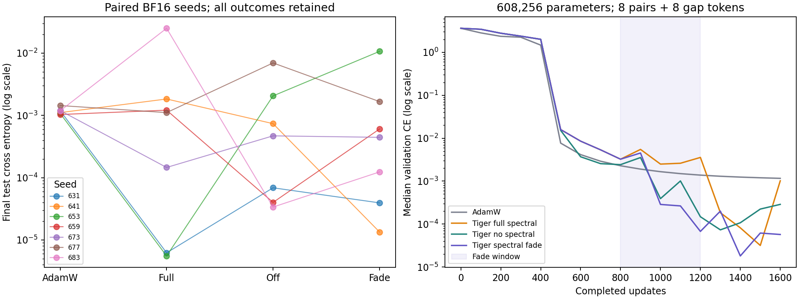

# Learned CUDA retrieval and spectral feedback

## Protocol

This study uses a causal Transformer with **608,256 parameters**, eight
key/value pairs, 32 possible keys/values, an eight-token gap, and four queries
per example (32 input tokens). Width is 128 with three layers and four heads.
Training uses 1,600 updates, batch 64, LR 0.001, gradient norm clipping at one,
and the benchmark's warmup/cosine schedule. Validation contains 512 examples;
the final original and rebound tests each contain 2,048 examples / 8,192 queries.

Hardware: **NVIDIA GeForce RTX 5090**, PyTorch **2.13.0+cu132**, CUDA 13.2,
two CPU threads. BF16 means autocast with FP32 parameter storage and optimizer
buffers; TF32 is disabled. The primary comparison uses seven new paired seeds:
631, 641, 653, 659, 673, 677 and 683. Seeds 631 and 641 also run in FP32 as
supplements. The two precision sets are reported separately.

The [development plan](preflight_plan.json) and
[confirmation plan](plan.json) were frozen before their respective data.
Eight validation-only development runs try LR 0.001 / 0.003 for AdamW and
Tiger on the short Mac-sized task and this medium task. At LR 0.001 both
optimizers pass original/rebound accuracy >=90% and obsolete-target accuracy
<=20% on medium; both fail at 0.003. The predefined rule chooses medium and
0.001 for each optimizer. No test data exists during development; all failures
are archived. This positive control does not establish learning of the older
[104-token CUDA stress task](../2026-09-30-cuda-recall/README.md).

## Controls and implementation

All paired runs share initialization, input hashes, minibatch order and LR
traces. The four configurations are AdamW, full Tiger spectral feedback,
Tiger with spectral feedback disabled, and Tiger with fading spectral
strength. Tiger settings match the existing isolated QKV recipe: tagged
groups, initial Q/K/V scales 0.9 / 0.8 / 1.1, separate slice trust, adaptive
slice LR with interval 25 and gain 0.02. FFN asymmetry, auto LR/blend and LoRA
cross-adaptation are off. QKV RMS is observed, without a matching intervention;
changed update magnitudes are part of the feedback effect.

The opt-in `qkv_spectral_strength` constructor argument defaults to one.
`optimizer.set_qkv_spectral_strength(value)` sets it eagerly before a step.
After clipping, frequency and phase corrections are each blended toward one:

```text
effective_correction = 1 + strength * (full_correction - 1)
```

Zero skips spectral collection while RMS/trust adaptation continues. Spectral
EMA history is retained through a pause; optimizer checkpoints save the
current strength. Older adaptive checkpoints without this field use strength
one. At full strength the clipped correction is used directly, avoiding
cancellation for extreme custom clips. The default setting exactly reproduces the development run's 1,600 loss,
gradient, QKV-update and validation traces and final weight SHA-256 under CUDA
BF16. Separate compatibility receipts retain this check for the study source
and the final implementation after the full-strength guard was added.

The fade recipe starts at one. For the update after `completed` updates:

```text
progress <= 0.50: strength = 1
0.50 < progress < 0.75: strength = (1 + cos(pi * (progress - 0.50) / 0.25)) / 2
progress >= 0.75: strength = 0
```

Its first-half model hashes are checked against full spectral feedback at
every sampled validation point through update 800. The schedule endpoints
were not tuned on confirmation outcomes. Strength and applied QKV RMS are
logged every update. Schema 5 additionally saves sampled model hashes.

## Results

### Primary BF16 comparison (seven seeds)

| Configuration | Mean test CE | Original accuracy | Rebound accuracy | Binding gates |
| --- | ---: | ---: | ---: | ---: |
| AdamW | 0.00117422 | 100% | 100% | 7/7 |
| Tiger full spectral | 0.00418338 | 99.916% | 99.916% | 7/7 |
| Tiger no spectral | 0.00147758 | 99.962% | 99.944% | 7/7 |
| Tiger spectral fade | 0.00193296 | 99.962% | 99.953% | 7/7 |

Full spectral lowers final CE in **4/7** paired seeds, but its mean CE delta
versus no spectral is **+0.00270580**. Seed 683 contributes a +0.02494158
delta, dominating the unfavorable average. Fade lowers CE versus full in
**3/7**, with mean delta **-0.00225042**: seed 683 contributes -0.02485174,
while seed 653 worsens by +0.01063693. These are mixed per-seed outcomes.
All seven full/fade first-half hash sequences match exactly.

### FP32 supplements (two seeds)

| Configuration | Mean test CE | Original accuracy | Rebound accuracy | Binding gates |
| --- | ---: | ---: | ---: | ---: |
| AdamW | 0.00114821 | 100% | 100% | 2/2 |
| Tiger full spectral | 0.0000259861 | 100% | 99.994% | 2/2 |
| Tiger no spectral | 0.00185463 | 99.957% | 99.976% | 2/2 |
| Tiger spectral fade | 0.00374813 | 99.933% | 99.976% | 2/2 |

Full lowers CE versus no spectral in **1/2** FP32 seeds, with mean delta
-0.00182864. Fade worsens CE versus full in **both** FP32 seeds, with mean
delta +0.00372215. Both full/fade first-half hash sequences match. These
supplements do not support a reliable fade advantage or a precision-invariant
ranking. The strength API makes the mechanism controllable; this study does
not justify a new default or recommended fade schedule.

See [summary.json](summary.json) for all per-seed outcomes and paired deltas.
The primary metrics are final test CE for full minus no spectral, and fade
minus full. Binding failures remain in both averages and paired comparisons.
Sampled validation CE and first >=90% validation step are secondary metrics.



These are conditional component comparisons on synthetic retrieval. AdamW is
a learned task control; these runs do not rank general-purpose optimizers.
Seven BF16 seeds and two FP32 supplements do not establish a precision or
hardware equivalence. Sequential timings include synchronization, safety
checks and diagnostics, so they are not throughput evidence. Production
defaults remain unchanged; fading is an experimental recipe.

## Raw receipts and replay

The archive retains 46 complete learning receipts: eight development runs,
two default-compatibility replays, 28 primary BF16 runs and eight FP32
supplements. Raw JSON is gzip-compressed without changing its decompressed
bytes. [manifest.json](manifest.json) stores source commits and raw hashes;
[preflight_selection.json](preflight_selection.json) and
[confirmation_index.json](confirmation_index.json) bind outputs to each plan.
The summarizer checks completion, Git/source hashes, every LR/strength trace,
binding scores and paired inputs. It regenerates confirmation inputs/model
initialization and verifies disjoint train/validation/test contexts. The
original Linux/PyTorch runtime separately reproduces all seven initial hashes.
Its [initializer receipt](initialization/receipt.json) retains the two small
FP32 embedding matrices per seed. On the Mac/PyTorch 2.12.1 runtime, native
normal embedding draws have different low bits; restoring those saved matrices
lets the remaining seeded parameters reproduce the full original model hash.
The summarizer reports the native mismatch and restored replay separately.
This establishes paired initialization within the CUDA study, without claiming
that a seed alone guarantees identical initialization across runtimes.

The original runtime also reproduces all 21 input hashes. Float32 key scores
occasionally tie: 19 rows across the seven seeds' three splits. Default
`argsort` tie ordering differs across runtimes. The
[input replay receipt](input_replay/receipt.json) retains those rows' original
key ordering; the verifier checks equal scores before restoring them and
reconstructing their query keys. On the Mac, native inputs match 18/21 split
hashes and native model initialization matches 0/7. With the saved tie ordering
and embedding bits, all 21 input hashes and all seven full model hashes match.
These are verification fixtures; the learning runs and their raw records are
unchanged.

Strength endpoints zero/one are checked exactly. Intermediate cosine values
use relative tolerance 1e-12 / absolute tolerance 1e-15 across host math
libraries; the observed Mac/Linux maximum absolute difference is 1.11e-16.
Raw traces and their hashes remain unchanged.

Use a Git clone with full history and a compatible CUDA PyTorch installation.
Recorded development source: `864624a`; confirmation and compatibility source:
`db2d12a3625419677255ab9bc1346fd1c230f92d`. Replay from separate clean worktrees
with an output directory outside both:

```sh
git worktree add --detach ../tiger-cuda-preflight 864624a
git worktree add --detach ../tiger-cuda-confirm db2d12a3625419677255ab9bc1346fd1c230f92d
python ../tiger-cuda-preflight/benchmarks/evidence/2026-10-02-cuda-spectral/run_preflight.py \
  --output-dir ../tiger-cuda-fresh
python ../tiger-cuda-confirm/benchmarks/evidence/2026-10-02-cuda-spectral/run_suite.py \
  --output-dir ../tiger-cuda-fresh
```

The first compatibility replay uses the confirmation source with the medium
development recipe: Tiger full, seed 607, BF16, LR 0.001, 1,600 updates,
validation size 256, `--development --measure-qkv-updates`. The
[final compatibility plan](compatibility_plan.json) repeats this after the
full-strength implementation guard. The compatibility runner requires the
original archived reference bytes, since a fresh development run has different
timing bytes. From the main checkout, prepare a separate fresh directory:

```sh
git worktree add --detach ../tiger-cuda-implementation 2cf2445
python - <<'PY'
import gzip
from pathlib import Path
output = Path("../tiger-cuda-compat-fresh")
output.mkdir()
name = "preflight-medium-tiger-full-0.001.json"
raw = Path("benchmarks/evidence/2026-10-02-cuda-spectral/raw") / (name + ".gz")
(output / name).write_bytes(gzip.decompress(raw.read_bytes()))
PY
python ../tiger-cuda-implementation/benchmarks/evidence/2026-10-02-cuda-spectral/run_compatibility.py \
  --output-dir ../tiger-cuda-compat-fresh
```

The runner checks reference SHA-256, every non-timing numeric trace and the
final hash. Exact training replay is scoped to the recorded runtime/hardware;
the portable verification fixtures are used by the offline summarizer. These
checks are separate from the 36 confirmation cases.

Verify and regenerate the committed archive on CPU:

```sh
cd benchmarks/evidence/2026-10-02-cuda-spectral
shasum -a 256 -c SHA256SUMS
cd ../../..
python benchmarks/evidence/2026-10-02-cuda-spectral/summarize.py
python benchmarks/evidence/2026-10-02-cuda-spectral/plot.py
```

Numeric results are checked against the frozen receipts. Plot pixels may differ
with Matplotlib versions; verify committed hashes before regenerating figures.
